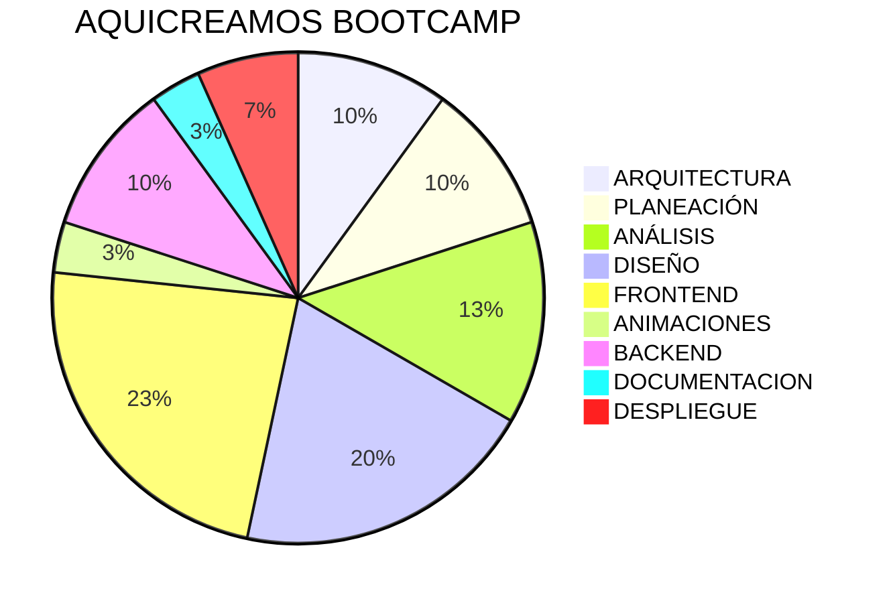

# Vamos a realizar en video algunas pruebas y vamos a incluirlas usando AI y Sheet Cheet
Aqui en este espacio vamos a incluir en video algunas pruebas y vamos a incluirlas usando AI y Sheet Cheet la parte academica se va a divir en 6 partes cada una de ellas con su respectivo aspecto teorico para formarnos como fullstack 

## Tecnologías 

### Analiticas ( Tiempo: 3h 45m - Teorica 2h )
Arquitecturas -> Protipados -> Requerimientos -> Diseño -> Analisis -> Tecnologías | Pendientes:  Patrones de Diseño

### Diseño ( Tiempo: 8h - Teórica 2h - Design Tocken 4h )
Herramienta vectoriales -> Taller de Figma uso completo de la herramienta -> introducción a Storybook -> Atomic Design -> Design Systems -> Design Tockens 

### Frontend ( Tiempo: 8h + 12h + 8h + 5h + 6h - 4h - 3h Teórica: 12h )
tailwind -> HTML5 -> Next js -> React ->  CSS3 -> TypeScript -> Zustand js -> React Query -> Framer motion -> Next UI -> Scroll Animations -> Animations -> Formik

### Backend ( Tiempo: 4h + 4h + 3h + 1h - Teórica: 5h )
Pendientes:  Patrones de Diseño -> Diseño del backend -> Python FastAPI -> Autenticación JWT AUTH  -> SQL - MYSQL -> json Mocks

### Repository ( Tiempo: 1h - Teórica: 15m )
-> GIT- GITHUB

### Despliegue ( Tiempo: 3h - Teórica: 3h )

### Tiempo FINAL aprox 22 dias 

## Contributing

Estos han sido las personas que han contribuido a nuestro proyecto!
Mira `contributing.md` para que puedas ver el listado de contribuyentes.
Por favor lee el codigo de conducta `code of conduct`.
